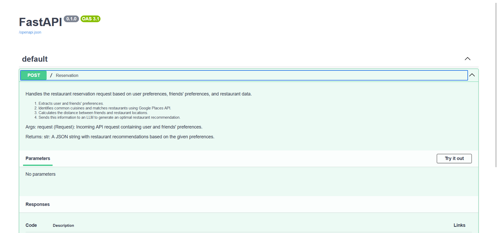

# AskOut - Restaurant Reservation (Backend Only)

**AskOut** is a sophisticated application designed to make restaurant reservations for users based on their preferences, including **cuisine**, **time**, and **address**. The app leverages **AI** to analyze and find matches from other users' data, ensuring an optimal dining experience.

It is built using **AI** technologies and the **Google Maps API** (API keys are securely stored in `config.json`).

FastAPI Endpoint**: `main.py` contains the FastAPI endpoint and essential utility functions.

### Core Features
  
- **AI-Powered Matching**: The application utilizes **AI** to identify suitable restaurant matches for users and their friends.

### Workflow

1. **Friend Identification**:
   - The application first identifies whether other users have the current user as a friend by using Python code.
   - It then checks for any common cuisines between the user and their friends.

2. **Restaurant Data Retrieval**:
   - Restaurant names, addresses, and operating hours are retrieved using the **Google Places API**, based on the user's **cuisine preferences**, **location**, and **search radius** (configured in `config.json`).

3. **Distance Calculation**:
   - The application calculates the distances between friends' addresses and the restaurant locations using the **Google Maps Distance Matrix API**.

4. **Prompt Generation for AI**:
   - A single prompt is constructed using:
     - User's info (name, cuisines, preferred dining time)
     - Friends' info (names, cuisines, preferred dining times)
     - Restaurant details (names, timings, distances from friends to the restaurant)
   - This prompt is sent to the language model (LLM) for matching.

5. **AI Model Used**:
   - Currently, the application uses **GEMINI-1.5-PRO** for generating restaurant matches.

6. **API Input Format**:
   - The `reservation.py` file calls the API with dummy inputs formatted as follows:

   ```json
   {
       "Person1": {
           "name": "Person1",
           "cuisines": "Chinese, Italian",
           "preferred time": "Weekends",
           "friend's name": ["Person2", "Person3"],
           "Address": "address 503"
       }
       // Same format for Person2, Person3
   }
7. API Call and Output
- The API call takes approximately **10 seconds** (currently not optimized) and returns a JSON string output that includes the matches and reservations at restaurants.
- This JSON string is saved locally as a JSON file.

### FastAPI Swagger-UI


### Running the API
1. Clone the repository.
2. In the terminal, run `uvicorn main:app --reload` to start the FastAPI server locally.
3. Modify the inputs in `reservations.py` (specifically the variable **preferences**) and run the file.
4. You should see a JSON file saved in your local storage, along with the JSON string printed in the terminal within a couple of seconds.

### Tech Stack
- **FastAPI**
- **Langchain**
- **Python**
- **Google Maps API**


(I worked on everything locally and didn't add a database or create a user interface. I focused mainly on the backend and implemented one of the features.)
